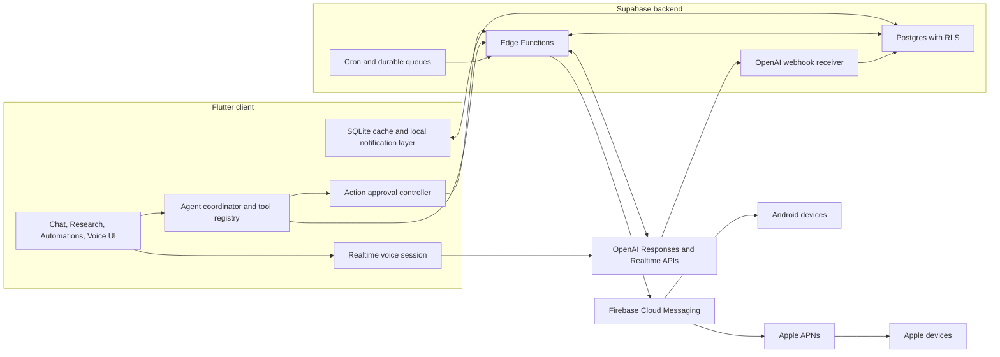

# HowAI 2.0 — Assistant Workspace

Status: Draft for product approval
Date: 2026-07-14
Current app version: `1.3.16+39`
Proposed release version: `2.0.0`

Repository scope: Flutter clients and the shared Supabase backend. The web
client is maintained and released from its own repository.

Implementation status (2026-07-16): M0 and the M1 GPT-5.6
evaluation/canary foundation are deployed. Production migration history, RLS,
privileges, advisors, and the current Edge Functions have been verified. The
private internal canary is enabled for internal test accounts and a
signed iPhone build has verified that its primary chat route resolves to
`gpt-5.6-sol`; the general user rollout remains disabled. M2 UX beta work is in
progress on `codex/howai-2-ux-beta`. M3 reminder actions and M4 Firebase push
delivery are implemented and have passed the internal physical-device flow.
M4.1 clean-interface refinement is complete. The M4.5 rollout-off foundation
and proposal/approval backend are deployed: durable run history, strict News
and Market briefing contracts, and an atomic paid-user approval path.
Static Reminder fallback is now prohibited for generated briefing requests.
The M4.5 conversation-first worker is deployed for internal canaries: bounded due-run
claims, metered live retrieval, deterministic source checks, independent AI
verification, an idempotent assistant message, and a Firebase deep link into
the stable Automation conversation. Market execution remains gated until a
structured market-data source exists. Physical-device validation remains
before full rollout. The M4.6 Places and Maps characterization foundation is
complete, while its full decomposition and visual redesign are deferred. M5
Realtime voice is the next active milestone.

M0 delivered:

- Reconciled the remote schema into migration history and added local security
  hardening without changing the existing client purchase-sync behavior.
- Added safe-default Flutter feature flags and shared agent action contracts.
- Added a service-owned entitlement boundary, feature flags, atomic usage
  reservations, cost ledger, and proxy telemetry columns.
- Added double-gated Sol/Luna/nano routing policy with the agreed free and
  anonymous guardrails; all flags remain off.
- Added terminal Responses SSE usage parsing so streaming requests can record
  tokens and estimated cost.
- Completed the M0 release-gate review: policy-off clients cannot select the
  new premium roles, policy lookup errors fail closed, cancelled streams retain
  their reservation, and first-token latency now starts at visible text output.
- Added conservative GPT-5.6 cache-write and long-context pricing, while only
  recording token fields that the Responses API currently returns.
- Added Flutter, Edge policy/stream, RLS/trigger, migration, and CI
  verification.

M1 foundation delivered:

- Confirmed from production telemetry that the current primary model route is
  `gpt-5.2`, not GPT-5.5; the last 30-day inventory contained 155 GPT-5.2 and
  98 nano proxy requests as of 2026-07-14.
- Added a private internal-account marker, deterministic 0–9,999 user buckets,
  `off`/`internal`/`percentage` rollout modes, and database-level rollback.
- Added requested/resolved model, cohort, bucket, eval version, latency, usage,
  cost, and bounded error-category telemetry without prompt/response content.
- Added the privacy-safe `gpt56-m1-v1` fixture suite and proxy evaluator; live
  baseline/candidate runs wait for an explicit internal Supabase user session.
- Kept explicit GPT-5.6 Sol/Luna/nano role mapping, `low` reasoning, standard
  service tier, and server-owned output/cost controls; optional GPT-5.6 modes
  remain disabled.

M1 paid-entitlement bridge delivered:

- Added a JWT-protected Supabase Edge Function that verifies StoreKit 2 JWS
  transactions with Apple's official server library and pinned Apple roots.
- Kept local StoreKit as the app UI/paywall source while caching only
  server-verified paid access in the service-only `app_entitlements` table.
- Existing subscribers bootstrap from the latest signed renewal in StoreKit
  history after sign-in, app resume, purchase, or restore; no repurchase is
  required.
- Enforced one App Store original transaction per HowAI account and preserved
  administrative entitlements during expired/revoked client syncs.
- Deployed the ownership migration and verifier while leaving the GPT-5.6
  environment gate and database rollout flag disabled.

M2 UX beta in progress:

- Removed the space-heavy persistent Chat, Research, and Actions tab bar; the
  unfinished workspaces remain hidden until they provide durable user value.
- Rebuilt the chat composer as one compact adaptive surface: it rests slightly
  inset, expands on focus, exposes dictation beside the live voice agent, and
  replaces both voice controls with Send while a draft exists. Web Search is
  model-selected automatically for eligible requests.
- Replaced the synchronous Deep Research toggle with a GPT-5.6 Thinking level
  control (`Auto`, `Fast`, `Balanced`, `Deep`). Paid users can select a level.
  Free users see the same control with a clear `Pro` label so the capability is
  discoverable; tapping it opens a concise upgrade explanation without losing
  the current draft. The proxy accepts only `low`, `medium`, or `high` for
  trusted paid GPT-5.6 requests and ignores the client override for free,
  legacy, or non-GPT-5.6 traffic.
- Shortened the input placeholder to a localized `Ask HowAI`, verified the
  one-line keyboard-open layout on iPhone, and added composer and large-text
  accessibility widget tests.
- Removed the forced first-run feature tour, delayed broad subscription banners
  until after users receive chat value, and fixed the dark-theme landing title.
- Added reusable Research/Actions empty states and the shared action-approval
  card that M3 reminders will consume.
- Added conversation content search, recency grouping, rename, archive/restore,
  delete, and synchronized archive state. The nullable production schema change
  is deployed with clean lint and advisor checks.
- Remaining M2 gates: replace preview workspaces with feature-flag-aware beta
  states, localize the new workspace and conversation labels, complete dynamic
  text/semantics review, and run the product UX review.

Free web search server slice — internal testing active:

- Give signed-in Free users limited automatic web search, following the same
  product principle as ChatGPT Free while retaining HowAI-owned cost limits.
- Keep the composer free of a persistent search toggle. Eligible Luna requests
  expose search with automatic tool choice; the model decides whether to call
  it.
- Enforce search eligibility, reservations, counters, and circuit breakers in
  the Supabase proxy and service-owned database layer before enabling the
  Flutter client.
- Added the disabled-by-default migration, private reservation table,
  service-only atomic RPCs, proxy eligibility, one-call clamp, SSE/JSON call and
  citation detection, and focused tests. The production migration and proxy
  v26 are deployed. The environment gate and `internal` database mode now
  expose the feature to one dedicated Free QA account; general users remain
  excluded.

M3 Actions beta delivered:

- Added service-owned `reminders` and `agent_action_runs` tables with owner-only
  reads, no client mutation grants, explicit audit state, per-user idempotency,
  and optimistic reminder versions.
- Added a JWT-protected `reminder-actions` endpoint. Model output can only create
  a proposal; an explicit user approval invokes the service-only atomic RPC.
- Added DST-safe one-time, every-N-day, selected-weekday/every-N-week,
  monthly-date, and ordinal-monthly recurrence using IANA timezones plus local
  wall-clock intent. Yearly and occurrence-count rules remain later recurrence
  extensions.
- Added the internal-beta strict `reminders_create` model tool for paid and free
  signed-in testers, an inline chat approval card, and an Actions workspace for
  review/edit/snooze/pause/resume/skip/complete/delete.
- M3 shipped durable scheduling and management without device wake-up; M4 now
  owns notification delivery independently of the reminder-write flag.

M4 Notification beta delivered for internal testing:

- Registered the existing Android and iOS application identifiers in the
  personal, push-only Firebase project `howai-fcm-sender` and generated the
  non-secret FlutterFire platform configuration. Supabase remains the app's
  auth and data backend.
- Added contextual notification permission, authenticated FCM token rotation,
  multi-device registration, sign-out cleanup, Android foreground
  presentation, and notification-to-Actions navigation.
- Added private device, occurrence, and per-device attempt records plus an
  idempotent `SKIP LOCKED` claim/lease worker, bounded retry, permanent-token
  cleanup, recurrence advancement, and a minute-level Supabase Cron trigger.
- The FCM HTTP v1 sender exchanges a server-only Firebase service-account key
  for short-lived OAuth tokens. No sender credential or FCM token is stored in
  Flutter source, Firebase configuration, or client-readable tables.
- Installed the least-privilege Firebase sender JSON and a random dispatcher
  secret in Supabase Edge Function secrets, stored the matching scheduler
  values in Vault, and verified the Cron-authenticated path returns HTTP 200.
- The APNs key is installed in Firebase for sandbox and production. Database,
  Edge, Flutter, Android, iOS device-target builds, physical-device delivery,
  notification registration, and reminder action flows have passed internal
  testing.

M4.1 and M4.5 design is captured in
[M4.1 UI refinement and M4.5 Automations](M4_1_UI_AND_M4_5_AUTOMATIONS.md).
The deferred Places and Maps work is captured separately in
[M4.6 Places and Maps refactor](M4_6_PLACES_MAPS_REFACTOR.md).

## 1. Executive decision

This should be treated as a major release. It changes HowAI from a chat-first app with separate utility features into an assistant workspace with persistent projects, realtime conversation, and user-approved actions.

The release has seven product pillars:

1. A coherent UI/UX foundation for Chat, Research, Automations, and Voice.
2. An entitlement-aware model upgrade: GPT-5.6 Sol for paid primary chat, with a tightly metered GPT-5.6 Luna experience and a low-cost fallback for free users.
3. Reminders and recurring reminders as the first agent actions.
4. Firebase-backed push notifications orchestrated by Supabase.
5. OpenAI Realtime voice and a persistent Research workspace.
6. A final content-first, lightweight UI pass with simpler navigation and less
   persistent chrome.
7. User-approved Automations for scheduled, source-validated briefings.

The release should be developed behind feature flags, validated with internal
accounts, and then enabled for all eligible users once its release gates pass.
Percentage cohorts are not part of the normal rollout process for this hobby
project. The existing ElevenLabs voice path should remain available as a
fallback until OpenAI Realtime meets the release gates.

### Delivery model

HowAI 2.0 is one release program, but implementation is phase-by-phase:

- Keep `main` releasable; use short-lived milestone branches and reviewed merges rather than one long-lived mega-branch.
- Every milestone ends with a working, tested build and an explicit exit gate.
- Backend schema/functions can deploy early with flags off; user-visible enablement waits for the matching client and beta gates.
- Continue automatically within an approved milestone. Pause only for a milestone review, external credentials, or a product decision that changes scope, safety, cost, or UX.
- Preserve a rollback or kill switch for GPT-5.6, reminder writes, push delivery, Realtime voice, and Research.

## 2. Product outcomes

At release, a user should be able to:

- Start a clean text conversation without navigating an overloaded composer.
- Receive text responses from the server-selected model for their entitlement, with paid primary chat on GPT-5.6 Sol and free usage kept inside a visible, predictable allowance.
- Say or type “Remind me every weekday at 8 AM to take my medication.”
- Review the interpreted schedule before anything is created.
- Create, edit, pause, resume, skip, complete, snooze, and delete reminders.
- Receive reminder notifications on Android and iOS while HowAI is closed.
- Open a notification directly into the relevant reminder and conversation.
- Start a low-latency speech-to-speech session, interrupt the assistant naturally, and see a live transcript.
- Create the same reminder from text or voice through one shared action system.
- Start long-running research, leave the app, receive completion notification, and reopen a saved report with sources.
- Schedule a daily or weekly briefing, receive a concise notification preview,
  and open the full, source-validated report with clickable citations.
- Understand what HowAI is doing, what it will change, and whether an action succeeded.

## 3. Scope boundaries

### Included

- UI theme and accessibility cleanup.
- Simplified chat composer and tool/mode selection.
- Improved onboarding, conversation management, and paywall behavior.
- Content-first navigation for Chat, Research, and Automations.
- Reminder and recurring-reminder tools.
- Reminder management workspace.
- Firebase Cloud Messaging for Android and iOS/APNs.
- Foreground/local-notification presentation and notification actions.
- OpenAI Realtime speech-to-speech voice over WebRTC.
- Persistent voice transcripts and shared text/voice tools.
- Persistent background Research projects, runs, sources, and reports.
- Automations for reminders, recurring reminders, news briefings, and market
  briefings, with per-run validation and durable history.
- Feature flags, kill switches, structured telemetry, tests, CI, and an
  internal-to-full rollout.
- Entitlement-aware text-model routing, with GPT-5.6 Sol for paid primary chat, metered GPT-5.6 Luna access for free accounts, evals, a canary, and instant rollback.

### Explicitly excluded from 2.0

- Google Calendar, Apple Calendar, Apple Reminders, Microsoft, Todoist, or Notion synchronization.
- Sending email, Slack, SMS, WhatsApp, or messages to other people.
- Shared reminders or family/team task lists.
- Location-triggered reminders.
- Autonomous purchases, reservations, or itinerary booking.
- Arbitrary user-supplied cron expressions or unrestricted scheduled agent
  prompts.
- Trading execution, individualized investment recommendations, or web-search-
  only stock prices and rankings.
- Removing the ElevenLabs implementation before Realtime has proven stable.
- Automatic adoption of GPT-5.6 Pro mode, Programmatic Tool Calling, multi-agent mode, explicit caching, or persisted reasoning without a separate measured need.

Itinerary building can follow in a 2.x release using the existing Places/Maps foundation. Calendar export and connectors should follow after the approval and audit infrastructure has been proven with reminders.

## 4. Current-state findings

- The Flutter application is the main client and uses Provider, SQLite, and Supabase.
- Mobile chat already uses the OpenAI Responses API through `openai-proxy` and already has a function-calling loop for PPTX generation.
- The effective linked mobile chat route is currently resolving to `gpt-5.2`; the client sends the alias `howai-chat`.
- The non-streaming Flutter chat route already uses the Responses API with explicit `low` reasoning for ordinary chat and `high` reasoning for the current Deep Research mode.
- The streaming Flutter route omits reasoning effort for ordinary chat; GPT-5.6 would therefore use its model default unless the proxy supplies an explicit value.
- Model choice is currently made partly from client-provided premium state. The proxy authenticates and rate-limits the user but does not verify subscription entitlement before resolving either chat alias, so a modified client can request the higher-cost route.
- The current streaming proxy writes its request log before the stream completes and therefore misses token usage. In the linked project's last 30 days, usage was captured for only 31 of 255 proxy requests; cost telemetry must be repaired before a GPT-5.6 canary.
- Free image analysis currently forces the main model, and free streaming requests can include web search by default. Both behaviors need server-enforced quotas because model, tool, and multimodal costs are separate.
- Voice calling is currently implemented through ElevenLabs in a dedicated 1,165-line screen and service.
- `OPENAI_REALTIME_MODEL` still references an old preview value and is not the production voice path.
- Firebase/FlutterFire is configured for the existing Android and iOS bundle
  identifiers in the personal `howai-fcm-sender` project. The Firebase sender
  credential is installed in Supabase; production delivery still needs an APNs
  `.p8` key uploaded to Firebase.
- The primary UI files are large: `ai_chat_screen.dart` is 6,803 lines and `chat_input_widget.dart` is 2,123 lines.
- The current UX backlog already calls for reducing composer action density.
- There is no `test/`, `integration_test/`, or CI workflow in the repository.
- Only proxy-related Supabase migrations are currently tracked locally, while the application uses additional remote tables. Schema history must be reconciled before new migrations are added.
- The existing sync review document is partly stale: sync and migration initialization now exist in code. The implementation, not old documentation, is the release baseline.

## 5. Target architecture

### Architectural rules

- Text and voice use the same tool definitions and action results.
- The model may propose an action but cannot directly commit a side effect.
- Reminder writes pass through deterministic validation and an authenticated action endpoint.
- Supabase is the reminder and research system of record.
- Firebase is the remote device-delivery network, not the scheduler or source of truth.
- OpenAI and Firebase long-lived credentials remain server-side.
- All new user-owned tables have explicit grants, owner-scoped RLS, indexes, and deletion behavior.
- Each action and delivery is idempotent and auditable.
- Scheduled generated content is never delivered directly from raw search
  output. It passes deterministic source checks and a separate model review;
  unverifiable claims are removed or the run fails closed.

## 6. Shared agent-action foundation

Build the action layer before implementing reminder-specific chat behavior.

### Flutter contracts

- `AgentToolDefinition`: name, description, strict JSON schema, risk level, availability.
- `ActionProposal`: action type, normalized arguments, human summary, warnings, origin, and proposal ID.
- `ActionApproval`: proposal ID, user decision, approval channel, and timestamp.
- `ActionResult`: success/failure, affected resource, display message, retryability, and audit ID.
- `AgentRunCoordinator`: handles model tool calls, approval pauses, execution, and tool outputs.
- `ActionApprovalController`: exposes pending proposals to chat and voice UI.

### First tool set

- `reminders_create`
- `reminders_list`
- `reminders_update`
- `reminders_complete`
- `reminders_snooze`
- `reminders_pause`
- `reminders_resume`
- `reminders_skip_next`
- `reminders_delete`

All schemas use strict mode, reject unknown fields, and are validated again by the backend. Tool availability is server-configurable.

### Approval behavior

- Creating, updating, pausing, resuming, skipping, or deleting shows an approval summary before execution.
- Completing or snoozing from a notification action can execute directly because the user selected an explicit OS action.
- Voice can accept an explicit verbal confirmation for low-risk reminder operations, but the proposal must first be read back with the exact date, time, timezone, and recurrence.
- Ambiguous date/time expressions cause a clarification turn, not a guessed write.
- Future higher-risk connectors can reuse the same system with stronger approval requirements.

### Idempotency

- The client creates an idempotency key per proposal execution.
- The backend stores the key with the action run and returns the existing result on retry.
- Notification deliveries are unique by reminder and scheduled occurrence.
- OpenAI webhook events are deduplicated by webhook ID.

## 7. Workstream 0 — GPT-5.6 migration and tiered model routing

GPT-5.6 is a model family. The current `gpt-5.6` alias routes to flagship `gpt-5.6-sol`; use explicit physical model IDs in server configuration so staging, logs, rate limits, and rollback remain predictable. The client sends an intent such as primary chat, lightweight chat, title, or research; the Supabase proxy verifies the entitlement and selects the physical model. It must not trust a client-selected premium alias.

This workstream applies to primary text chat and text-agent orchestration. OpenAI Realtime voice remains on the dedicated Realtime model, and persistent Research uses an evaluated research model rather than ordinary GPT-5.6 chat.

### 0.1 Inventory and role mapping

- Map every active model usage, endpoint, prompt, reasoning setting, tool set, parser, timeout, fallback, analytics label, and environment variable.
- Migrate paid primary chat from the effective `gpt-5.2` route to `gpt-5.6-sol`.
- Keep `gpt-5-nano` as the free fallback and for background classification, titles, routing, and other lightweight work, including for paid users.
- Evaluate `gpt-5.6-luna` as a metered free-tier experience. Do not replace `gpt-5-nano` globally: Luna is 20 times its input price and 15 times its output price.
- Reserve `gpt-5.6-terra` for evaluated fallback or a future mid-tier use case; free clients cannot request Terra or Sol directly.
- Treat background Research and Realtime voice as separate model roles.

### 0.2 Entitlement routing and cost controls

Current standard text-token prices per 1 million tokens:

| Model | Input | Cached input | Output | Intended HowAI role |
|---|---:|---:|---:|---|
| `gpt-5-nano` | $0.05 | $0.005 | $0.40 | Free fallback and lightweight background work |
| `gpt-5.6-luna` | $1.00 | $0.10 | $6.00 | Metered free smart-answer allowance |
| `gpt-5.6-terra` | $2.50 | $0.25 | $15.00 | Evaluated fallback or future mid-tier role |
| `gpt-5.6-sol` | $5.00 | $0.50 | $30.00 | Paid primary chat |

Use the following server-owned policy for the beta; every number remains remotely configurable:

- Anonymous: `gpt-5-nano`, five successful chat answers per rolling day, 400 output tokens per answer, and no paid built-in tools or attachments.
- Signed-in free: `gpt-5-nano` by default; up to three Luna answers per rolling day within a $0.03 daily and $0.30 monthly model-cost budget; fall back to nano when the Luna allowance is exhausted.
- Paid: GPT-5.6 Sol for primary chat with explicit `low` reasoning by default. Use higher reasoning only for an intentional user-visible mode. Keep titles, intent classification, and other background work on nano.
- Research, Realtime voice, image generation, and web search have separate ledgers and quotas. Web search is never attached to every free request by default.
- Count web search at its separate current price of $0.01 per call, in addition to model tokens; one search can cost more than a short Luna-only answer.
- Enforce a free-tier preflight limit for text, image detail, attachment count, and extracted file content. Require an upgrade or a smaller input before sending an over-budget request upstream.
- Set output limits and reasoning effort in the proxy by entitlement and intent. Do not accept a larger client value.

Implement entitlement and budget enforcement atomically on the server:

- Resolve active subscription status in the proxy or a security-definer RPC; never rely on `isPremiumUser` from Flutter.
- Reserve estimated budget before the OpenAI request, reconcile it from final usage, and release or adjust the reservation on failure.
- Count cached input, cache-write pricing, output/reasoning tokens, built-in tool calls, images/files, and long-context price multipliers in the cost ledger. Until Responses usage exposes a separate cache-write token count, reserve and reconcile GPT-5.6 input conservatively rather than fabricating token telemetry.
- Parse the terminal Responses SSE event so streaming calls record usage, resolved model, reasoning effort, latency, and cost. The current pre-stream log is insufficient.
- Apply per-user and global daily/monthly circuit breakers in addition to request-rate limits, and expose an administrative kill switch for each expensive route.

The beta allowance is a starting economic guardrail, not a permanent product promise. Recalibrate it after two weeks of complete usage telemetry and conversion/retention data.

### 0.2.1 Free web search release policy

Status: **internal Free-account testing active**. The production migration and
proxy v26 have passed deployment, privilege, advisor, and route checks. The
environment gate is enabled and the database flag is limited to `mode:
internal`; one dedicated Free QA account is allowlisted. General users remain
excluded.

Internal test log (2026-07-15, iPhone Simulator): the first current-news
request passed the server path—`gpt-5.6-luna`, one completed search call,
citations detected, both ledgers reconciled, and no exposure outside the
dedicated account. The sample reached visible text in 8.647 seconds and
completed in 10.423 seconds. Its conservative total request estimate was
30,153 microUSD while the separate Free-search circuit breaker accounted
15,000 microUSD. The internal hardening pass is now deployed: search requests
pre-reserve 40,000 microUSD for concurrency safety and reconcile the search
circuit breaker to the complete actual request estimate; server-owned response
guidance requires the requested item count and inline citations without a
second source appendix. The Flutter client no longer inserts the subscription
banner above active conversations or duplicates citation annotations as a raw
source list. Remaining internal checks are a simulator retest of the second
allowed searched answer, a no-search small-talk request, quota denial on the
third searched answer, cancellation, and the kill switch.

ChatGPT currently makes search available to Free users and can decide
automatically when a prompt benefits from current web information. HowAI will
adopt the same availability principle, but not attempt to copy undisclosed
ChatGPT rate limits. HowAI owns the API bill and therefore uses explicit,
remotely configurable allowances.

Initial beta defaults:

| Cohort | Search access | Per-user allowance | Model/tool policy |
| --- | --- | --- | --- |
| Anonymous | Disabled | 0 | Keep nano-only abuse boundary for the first release |
| Signed-in Free | Automatic | 2 completed searched answers per rolling day and 20 per rolling month | Luna only, `tool_choice: auto`, low search context, at most one web-search call per response |
| Paid | Automatic | Existing paid cost circuit breakers; does not consume the Free allowance | Sol, automatic tool choice, server-owned limits |

Additional global Free-search circuit breakers start at `$1.00` per rolling day
and `$10.00` per rolling month, including the search tool charge and estimated
search-content/model tokens. These are safety ceilings for the hobby-project
beta, not product promises. They must be remotely configurable without an app
release.

#### Product and UX behavior

- Do not restore a persistent Web Search button or an active-mode chip.
- Do not add a classifier API call before each message. Search is offered only
  on an otherwise eligible Luna request; the model decides whether it is
  necessary.
- Quick/small-talk requests keep the existing no-search profile. Search never
  turns a greeting into a slower Luna/tool request by itself.
- A searched answer must retain its inline citations and source links in both
  streaming and non-streaming paths.
- If the Free search allowance or global circuit breaker is exhausted, remove
  the tool before the upstream request and add a bounded instruction that the
  assistant must not claim it verified current information. For a clearly
  time-sensitive question, return a localized explanation with the next reset
  time and the paid option instead of silently presenting stale facts.
- Do not advertise Free search as unlimited. The limit/reset state should be
  visible only when relevant, not as permanent composer clutter.

#### Server-owned eligibility and accounting

- The Flutter client may request automatic search, but it cannot grant itself
  a model, entitlement, allowance, or larger tool-call limit.
- The proxy verifies a trusted signed-in entitlement and resolves the request
  to Luna before allowing Free search. Nano fallback does not receive web
  search in the first release.
- Clamp the Responses request to `max_tool_calls: 1` when Free web search is
  available. Expose only the normalized `web_search` tool with low search
  context on that route.
- Reserve a conservative search budget atomically before calling OpenAI. The
  reservation covers the current `$0.01` tool-call price plus configurable
  search-content/model-token headroom.
- Release the search reservation and consume no user search allowance when the
  model does not emit a `web_search_call`.
- Count a user allowance only when a final answer succeeds and includes a
  completed `web_search_call`. Record actual provider spend even if a search
  occurred before a later response failure, so global cost telemetry remains
  honest without penalizing the user's allowance for a failed answer.
- Reconcile both terminal JSON and terminal SSE responses. Store the actual
  search-call count in `ai_usage_ledger.tool_calls`; do not infer a call merely
  because the request exposed the tool.
- Search-capable Free responses consume the existing Luna answer/cost allowance
  as well as the separate search allowance. Reservation and reconciliation
  must remain safe under simultaneous requests from the same user.
- Keep quota tables and reservation functions service-owned in a private,
  unexposed schema. If privileged database functions are required, revoke
  `PUBLIC` execution, authenticate in the Edge Function, and do not expose the
  service-role key to Flutter.

#### Flags, telemetry, and rollback

- Add a server-managed `free_web_search` flag with `off`, `internal`, and `on`
  modes. `internal` limits access to approved test accounts; `on` enables all
  otherwise eligible signed-in Free accounts. `off` must instantly restore the
  current behavior without a client release.
- Record search offered, search called, quota denied, reservation/reconciliation
  result, resolved model, citations present, first-token latency, total latency,
  and estimated cost. Do not record prompts, responses, or raw search queries.
- Roll out to internal Free test accounts, then enable all eligible signed-in
  Free accounts after cost and citation checks pass.
- Keep a separate global Free-search kill switch even after full rollout.

#### Implementation order and exit gates

1. **Complete locally:** add the private atomic reservation/reconciliation
   migration and concurrency-oriented quota tests without enabling search.
2. **Complete locally:** extend `openai-proxy` to enforce entitlement, Luna
   routing, normalized tool shape, `max_tool_calls`, SSE/JSON call detection,
   citation telemetry, and transparent fallback.
3. Enable Free automatic search in Flutter only after the migration and proxy
   deployments are verified; keep the UI toggle absent.
4. Run internal tests for current news, weather, prices, sports, no-search small
   talk, citations, allowance reset, two simultaneous requests, upstream
   failure, streaming cancellation, and the global kill switch.
5. Approve full rollout only when no client can bypass the limits, every
   searched answer has usable citations, non-search latency is unchanged, and
   observed cost remains within the configured budgets.

Official references:

- [ChatGPT Search availability and automatic behavior](https://help.openai.com/en/articles/9237897-chatgpt-search)
- [ChatGPT Free plan capabilities](https://help.openai.com/en/articles/9275245-using-chatgpt-s-free-plan)
- [OpenAI built-in tool behavior](https://developers.openai.com/api/docs/guides/tools)
- [OpenAI API pricing](https://developers.openai.com/api/docs/pricing)
- [Responses API request controls](https://developers.openai.com/api/reference/resources/responses/methods/create)
- [Supabase Edge Functions](https://supabase.com/docs/guides/functions)
- [Supabase database functions](https://supabase.com/docs/guides/database/functions)

### 0.3 Preserve behavior before prompt changes

- Use an explicit reasoning effort for the first GPT-5.6 comparison: `low` for ordinary/mobile chat and `high` for the current synchronous Deep Research path.
- Compare the same effort and one level lower only after the baseline passes.
- Keep current tool names, JSON schemas, call IDs, continuation logic, response parsers, and output limits during the first model-only comparison.
- Do not simultaneously rewrite the system prompt. Run evals after the model switch, then make one surgical prompt/tool-description change at a time.
- Make image/file detail explicit where token or latency cost matters, because GPT-5.6 multimodal detail behavior can differ.

### 0.4 Evaluation set

Build a versioned, privacy-safe evaluation fixture set covering:

- Casual conversation and concise answers.
- Long and multi-turn conversations using `previous_response_id`.
- Web search with citations and current-information questions.
- Image/file inputs and worst-case context sizes.
- PPTX function calling and multi-step tool continuation.
- Multilingual conversations across supported locales.
- Safety/refusal boundaries and privacy-sensitive prompts.
- Reminder create/update/delete proposals, ambiguous times, recurrence, and mandatory approval behavior.
- Research routing so ordinary chat does not impersonate a completed background research run.

Record task success, schema validity, tool selection/arguments, final-answer completeness, safety behavior, output tokens, cached tokens, cache-write tokens, latency, and cost.

### 0.5 Prompt migration

After the model-only baseline:

- Remove repeated or contradictory instructions only where eval traces show no product loss.
- Keep outcomes, success criteria, permission boundaries, evidence/citation rules, output contracts, and stopping conditions explicit.
- Use `text.verbosity` where consistent response length is more reliable than broad prompt instructions.
- Keep action approval rules compact and centralized so GPT-5.6 can be proactive inside safe boundaries without executing external or side-effecting work prematurely.
- Re-run the same fixtures after each prompt or reasoning change.

### 0.6 Internal validation and rollback

- Use the existing candidate-model and internal-account cohort controls. The
  percentage-bucket machinery may remain as rollback infrastructure, but it is
  not a release stage and requires no additional rollout UI or process.
- Follow a simple operating sequence: internal accounts, then all eligible
  users after the gates pass.
- Log requested alias, resolved model, cohort, reasoning effort, latency, usage, tool outcome, and error category without logging user content.
- Roll back by setting the GPT-5.6 cohort to 0%; no client release should be required.
- After full-release stabilization, update the source fallback and active configuration together so deployment behavior is not dependent on an old `gpt-5.2` fallback.

### 0.7 GPT-5.6 exit gates

- Representative task success is no worse than the GPT-5.2 baseline and improves on the agreed priority scenarios.
- Reminder/action tool schemas remain valid and no action executes without approval.
- PPTX, web search, image/file, multilingual, and long-conversation regressions are resolved or explicitly accepted.
- Latency and cost stay within product-approved budgets at the selected reasoning levels.
- Alias resolution, observability, canary assignment, and rollback are verified in staging.
- Web and mobile do not silently use incompatible model/endpoint contracts.

Official references:

- [Using GPT-5.6](https://developers.openai.com/api/docs/guides/latest-model?model=gpt-5.6)
- [Upgrading to GPT-5.6 Sol](https://developers.openai.com/api/docs/guides/upgrading-to-gpt-5p6-sol)
- [Prompting guidance for GPT-5.6 Sol](https://developers.openai.com/api/docs/guides/prompt-guidance-gpt-5p6)

## 8. Workstream A — UI/UX foundation

### A1. Component and state extraction

Avoid rewriting the entire chat screen at once. Extract stable seams while preserving current behavior:

- `lib/features/chat/`
- `lib/features/actions/`
- `lib/features/reminders/`
- `lib/features/voice/`
- `lib/features/research/`
- `lib/core/agent/`
- `lib/core/notifications/`

Extract the chat shell, composer, mode picker, empty state, action card, subscription state, and voice launcher from the existing monoliths. Keep Provider for this release instead of introducing a second state-management system.

### A2. Navigation

Keep Chat as the content-first home and avoid a persistent mobile tab bar.
Conversation history, Research, and Automations live in the navigation sheet;
new chat remains a single top-bar action. Voice remains a primary action inside
the Chat composer. Notifications and inline action results deep-link directly
to the relevant Automation or Research run.

### A3. Composer

The resting composer contains:

- Attachment/tool button.
- Text field.
- Voice button.
- Send button.

Research, Places, Images, Documents, and other modes move into a single mode/tool sheet. Remove duplicate Research affordances and keep mode state visibly attached to the composer only while active.

The Thinking level is also available from this sheet:

- Paid users can choose `Auto`, `Fast`, `Balanced`, or `Deep`; the selected
  level remains visible near the composer only while it differs from `Auto`.
- Free users see a compact `Thinking · Pro` row rather than a hidden feature or
  a permanently disabled composer control. Tapping it previews the levels and
  opens the contextual subscription screen; it does not change the active
  request.
- The client display is promotional, not authoritative. Entitlement and the
  final reasoning effort remain server-owned.

### A4. First-run and empty states

- Fix theme-aware text and the invisible dark-mode landing headline.
- Replace the forced feature tour with a short, skippable introduction.
- Use contextual tips when the user first opens Voice, Research, or Automations.
- Provide one clear first-message and first-voice-call path.
- Request notification permission only after the first reminder is approved.

### A5. Conversation management

- Search message content as well as titles.
- Rename, archive, delete, pin, and restore conversations.
- Group by meaningful recency rather than showing raw creation time alone.
- Add offline/sync indicators without interruptive error dialogs.

### A6. Subscription UX

- Do not show an upgrade banner before the user has experienced core value.
- Remove the double Knowledge Hub paywall pattern.
- Use one contextual upgrade surface per blocked capability.
- Preserve user work when an upgrade is required.

### A7. Voice UI

- Use one primary call control rather than competing orb/button calls to action.
- Show deterministic states: connecting, listening, thinking, speaking, reconnecting, ended, and failed.
- Include mute, speaker/route, transcript, elapsed time, end call, and connection quality.
- Provide a text fallback on every voice failure.

### A8. Accessibility and localization

- Meet WCAG AA contrast for text and controls.
- Support dynamic text without clipping at the largest supported sizes.
- Add semantic labels, focus order, reduced-motion behavior, and minimum touch targets.
- Add all new source strings to the localization system and prevent missing-key regressions.
- Treat the app locale as a fallback, not a single-language response lock.
  Preserve natural multilingual and code-switched conversations.

### A9. M4.1 clean-interface refinement

- Reduce top and bottom chrome and keep the message area visually dominant.
- Use a calm neutral surface, subtle dividers, restrained accent color, and
  fewer card-within-card treatments.
- Render assistant content as readable page content and use a light bubble only
  for user messages. Keep compact Copy, Listen, Report, and More controls
  visible below completed assistant messages so reporting stays discoverable.
- Keep the composer compact at rest, expand it on focus, and hide dictation and
  live-voice controls as soon as typed content makes Send the primary action.
- Show tool or thinking state only while it is active. Secondary capabilities
  belong in the `+` sheet, not as permanent controls.
- Split the remaining chat and composer monoliths along tested feature seams so
  future UI changes do not repeatedly regress keyboard, OAuth, or notification
  behavior.

## 9. Workstream B — reminders and recurring reminders

### B1. Supported recurrence in 2.0

- One-time.
- Every N days.
- Selected weekdays.
- Every N weeks on selected weekdays.
- Monthly on a date.
- Monthly on an ordinal weekday, such as the second Friday.
- Yearly.
- Optional end date. Ending after a number of occurrences remains a later
  extension.

Store a validated structured recurrence object rather than accepting arbitrary cron expressions. Persist the user’s IANA timezone and local wall-clock intent, then compute `next_fire_at` in UTC. Recalculate from the local recurrence after every occurrence so daylight-saving changes do not move an 8 AM reminder to 7 AM or 9 AM.

### B2. Reminder UI

The Automations destination contains:

- Today.
- Upcoming.
- Recurring.
- Completed.
- Paused.

Each reminder supports detail, edit, complete, snooze, pause/resume, skip next,
delete, notification history, and a link back to the originating conversation.
Editing exposes a structured Outlook-style recurrence control: one-time,
daily/weekly/monthly frequency, every-N interval, selected weekdays,
day-of-month or first/second/third/fourth/last weekday, and an optional end
date. The UI never stores arbitrary cron text.

### B3. Text flow

1. User asks for a reminder.
2. The model emits a strict reminder tool call.
3. The client validates and normalizes the proposal.
4. An inline approval card shows the exact schedule and recurrence.
5. User confirms or edits.
6. The authenticated action endpoint revalidates and writes the reminder.
7. The result is written into the chat and action history.

### B4. Voice flow

1. The Realtime agent proposes the same tool call.
2. The assistant reads back the normalized reminder.
3. The user confirms verbally or taps Confirm.
4. The shared action endpoint executes it.
5. The result returns to the voice session and persistent transcript.

### B5. Offline behavior

- Reminders already synced to the device remain viewable offline.
- Offline create/edit operations enter the existing local sync queue with visible pending state.
- The app must not claim a reminder is active until the server acknowledges it or a local-only fallback has been scheduled.
- Conflicts use explicit versioning for reminders; silent last-write-wins is not sufficient for schedule edits.

## 9.5 Workstream B.5 — generated Automations

The user-facing umbrella is **Automations**. `cron`, queues, and scheduled jobs
remain backend implementation terms. The first generated Automation templates
are daily/weekly news briefings and market-open/market-close briefings.

Every generated run follows this delivery contract:

1. Claim the due occurrence idempotently.
2. Retrieve current sources with live web access and retain the complete source
   list.
3. Reject inaccessible, stale, mismatched, low-quality, or disallowed sources.
4. Build a claim-to-source map and run a separate AI verification pass that
   checks support, dates, contradictions, and whether the summary overstates
   the source.
5. Remove unsupported claims or fail the run; never invent filler to meet an
   item count.
6. Save the report, source metadata, verification result, and usage ledger.
7. Send only a privacy-safe preview through Firebase and deep-link to the full
   report with visible, clickable citations.

For prices, movers, volume, rankings, and market-calendar facts, use a licensed
structured market-data source. Web search may explain market context but is not
the authoritative numeric feed. The first release does not execute trades or
provide personalized investment advice.

See [M4.1 UI refinement and M4.5 Automations](M4_1_UI_AND_M4_5_AUTOMATIONS.md)
for product behavior, data model, cost policy, validation gates, and rollout.

## 10. Workstream C — push notification delivery

### C1. Firebase client setup

- Create or select a Firebase project.
- Register Android and iOS apps for the existing application identifiers.
- Run FlutterFire configuration and commit non-secret platform configuration.
- Add and pin `firebase_core` and `firebase_messaging`.
- Add and pin a local-notification package for foreground presentation and notification actions.
- Configure Android notification channels and icons.
- Enable iOS Push Notifications plus Background Modes/Remote Notifications.
- Upload an APNs `.p8` authentication key to Firebase.
- Handle permission state, APNs readiness, FCM token creation, and token refresh.

### C2. Device registration

- Register each FCM token against the authenticated Supabase user.
- Support multiple devices per user.
- Record platform, app version, timezone, permission state, last seen, and enabled state.
- Remove or disable tokens on sign-out and after permanent FCM errors.
- Never place Firebase service-account credentials in Flutter assets or source control.

### C3. Server delivery

- Supabase Cron runs the due-reminder dispatcher at minute granularity.
- A transactional database routine claims due occurrences, creates idempotent delivery records, advances recurrence state, and enqueues work.
- A short-lived Edge Function batch consumes queued deliveries and calls the FCM HTTP v1 API.
- Credentials are read from Supabase secrets and exchanged for short-lived OAuth access tokens.
- Retries use bounded exponential backoff; permanent token errors disable the token.
- Structured delivery results are stored for operations and user-visible history.

### C4. Hybrid reliability strategy

The server remains authoritative. FCM is the cross-device path. Local notification scheduling may be used on the active device for more precise delivery, but only after duplicate-suppression is implemented and tested. The release must never show both a local and remote copy of the same occurrence.

The rollout can start with FCM as the primary delivery path and enable local scheduling behind a separate flag after physical-device testing demonstrates correct duplicate handling.

### C5. Notification UX

- Notification tap deep-links to reminder detail.
- Actions: Complete, Snooze 10 minutes, Snooze 1 hour.
- Lock-screen privacy preference: full reminder text or generic “HowAI reminder.”
- Foreground notifications use an in-app banner and local presentation rather than disappearing silently.
- Research-complete notifications reuse the same delivery service with a different payload type.

## 11. Workstream D — OpenAI Realtime voice

OpenAI’s current voice guidance recommends WebRTC for client/mobile Realtime connections and a server-created ephemeral client secret. The current documented voice-agent example uses `gpt-realtime-2.1`; keep the production model server-configurable rather than hard-coding it in Flutter.

### D1. Backend session endpoint

Add an authenticated `realtime-session` Edge Function that:

- Validates the Supabase JWT and subscription entitlement.
- Applies per-user session-start rate limits and active-session limits.
- Creates a privacy-preserving OpenAI safety identifier from the internal user ID.
- Builds the approved session instructions, voice, tools, and limits server-side.
- Requests a short-lived Realtime client secret from OpenAI.
- Returns only the ephemeral session material to Flutter.
- Records session-start metadata without storing secrets.

### D2. Flutter transport

- Add and pin a maintained WebRTC package.
- Implement `VoiceSessionService` as a provider-neutral interface.
- Implement `OpenAIRealtimeVoiceService` using WebRTC audio and the Realtime data channel.
- Wrap the current ElevenLabs path in the same interface for fallback.
- Handle microphone permission, audio focus, Bluetooth/headsets, speaker routing, app backgrounding, interruption, reconnect, and cleanup.

### D3. Session behavior

- Natural turn detection and barge-in.
- Live user and assistant transcript.
- Mute/unmute and explicit end call.
- Tool proposals delivered through the shared approval controller.
- Transcript segments persisted into the selected conversation.
- A call summary card after ending.
- Recovery to text chat if the call cannot reconnect.

### D4. Usage and cost controls

- Keep free/premium per-call and daily/weekly policy server-configurable.
- Rate-limit ephemeral-session creation independently from text chat.
- Record connection, duration, model, disconnect reason, response usage events, and tool outcomes.
- Compare client-observed usage with OpenAI project usage during beta.
- Add immediate server kill switches for new sessions and reminder tools.

### D5. Migration strategy

- Internal builds: OpenAI Realtime opt-in.
- Beta: OpenAI default with an automatic/manual ElevenLabs fallback.
- Production: staged enablement by account cohort.
- Remove the old path only in a later release after reliability, cost, and quality targets are met.

Official references:

- [OpenAI Voice agents](https://developers.openai.com/api/docs/guides/voice-agents)
- [OpenAI Realtime with WebRTC](https://developers.openai.com/api/docs/guides/realtime-webrtc)
- [OpenAI function calling](https://developers.openai.com/api/docs/guides/function-calling)

## 12. Workstream E — persistent Research workspace

The current “Deep Research” mode is a synchronous high-reasoning chat configuration, not a durable research job. Replace it with explicit projects and background runs.

### E1. Research UI

- Project list with status, update time, and source count.
- Project detail containing prompt, follow-ups, runs, sources, files, and reports.
- Progress states that survive navigation and app restarts.
- Clearly clickable inline citations and a source drawer.
- Retry, duplicate, continue research, rename, archive, delete, export, and share.

### E2. Backend flow

1. Authenticated client creates a research project/run.
2. `research-start` validates quota and starts an OpenAI background Response with an approved research model and tools.
3. Store the OpenAI response ID, model, status, and timestamps.
4. A signed OpenAI webhook notifies `openai-webhook` of completion or failure.
5. The function deduplicates the webhook, retrieves the result promptly, and persists report text, annotations, sources, and tool events.
6. The shared notification service tells the user the report is ready.

The research model stays server-configurable. Model selection and prompt changes require evaluation fixtures before rollout.

### E3. Persistence and privacy

- Persist final report and source metadata in Supabase; do not depend on temporary provider retention.
- Store uploaded private-source references with owner-scoped access.
- Verify webhook signatures using the raw request body.
- Delete provider-linked IDs and stored artifacts when the user deletes a project/account, subject to billing/audit retention requirements.

Official references:

- [OpenAI Deep research](https://developers.openai.com/api/docs/guides/deep-research)
- [OpenAI Webhooks](https://developers.openai.com/api/docs/guides/webhooks)

## 13. Proposed backend data model

The exact SQL should be generated only after the linked remote schema is pulled and reconciled.

### Core actions

`agent_action_runs`

- `id`
- `user_id`
- `conversation_id`
- `origin` (`text`, `voice`, `notification`, `system`)
- `action_type`
- `arguments`
- `human_summary`
- `status` (`proposed`, `approved`, `rejected`, `executing`, `succeeded`, `failed`)
- `idempotency_key`
- `error_code`, `error_message`
- `proposed_at`, `approved_at`, `completed_at`

### Reminders

`reminders`

- `id`, `user_id`, nullable `conversation_id`, nullable `action_run_id`
- `title`, nullable `notes`
- `timezone`
- `start_local`
- `next_fire_at`
- nullable structured `recurrence_rule`
- `status` (`active`, `paused`, `completed`, `cancelled`)
- `version`
- `last_fired_at`, `completed_at`, `created_at`, `updated_at`

`reminder_deliveries`

- `id`, `reminder_id`, `user_id`
- `scheduled_for`
- `delivery_type`
- `status` (`queued`, `sending`, `sent`, `failed`, `suppressed`)
- `attempt_count`, `next_attempt_at`
- `provider_message_id`, `error_code`, `error_message`
- unique occurrence/idempotency constraint

### Devices and preferences

`user_devices`

- `id`, `user_id`
- `installation_id`
- `fcm_token`
- `platform`, `app_version`, `timezone`
- `notification_permission`
- `enabled`, `last_seen_at`, `created_at`, `updated_at`

`notification_preferences`

- `user_id`
- reminder/research toggles
- quiet hours and timezone
- lock-screen privacy mode
- updated timestamp

### Voice

`voice_sessions`

- `id`, `user_id`, nullable `conversation_id`
- `provider`, `model`
- `started_at`, `ended_at`, `duration_seconds`
- `status`, `end_reason`
- connection and usage summary
- tool proposal/execution counts

### Research

- `research_projects`
- `research_runs`
- `research_sources`
- `research_artifacts`
- `openai_webhook_events`

### Automations

`automations` stores the approved template, schedule, timezone, delivery
preferences, status, version, and next run. `automation_runs` stores one unique
scheduled occurrence, generation/verification state, report, source metadata,
usage, bound-conversation message identifier, and bounded failure details. A
push is only a preview and deep link to that durable assistant message; one new
conversation must not be created per occurrence. Keep the existing `reminders`
table and contracts intact for installed-client compatibility; reminders
appear under the Automations UI without a destructive schema rename.

Every user-owned table must enable RLS and enforce `(select auth.uid()) = user_id` for reads and writes. Update policies require both `USING` and `WITH CHECK`. New public tables also need explicit Data API grants because current Supabase projects may not expose them automatically.

## 14. Supabase migration and function plan

Before feature migrations:

1. Confirm the linked project and create/use a non-production environment.
2. Pull and review the current remote schema so local migration history reflects reality.
3. Run database advisors and resolve security/performance findings relevant to touched objects.
4. Create migrations using `supabase migration new`; do not invent migration timestamps manually.
5. Add extensions only after verifying linked-project versions and changelog compatibility.

Expected new Edge Functions:

- `agent-actions`
- `realtime-session`
- `reminder-dispatch`
- `research-start`
- `openai-webhook`
- `automation-worker`

Expected scheduled/backend components:

- Due-reminder claim/enqueue routine.
- Recurrence calculator with deterministic tests.
- Queue consumer for FCM delivery.
- Webhook deduplication and research-result persistence.
- One global due-Automation scheduler plus a durable queue; do not create one
  database cron row per user.
- Generated Automations have a hard once-per-day minimum cadence, a two-active
  cap per paid user, bounded claim batches/retries, and atomic per-user plus
  project-wide cost reservations. Minute-level and hourly schedules are
  rejected rather than approximated with Reminders.
- A direct OpenAI worker path using shared policy and usage-ledger code. Avoid
  chaining the scheduled worker through another Edge Function because hosted
  Supabase now rate-limits nested/recursive Edge Function calls.
- Server-managed feature flags and kill switches.

Supabase references:

- [Scheduling Edge Functions](https://supabase.com/docs/guides/functions/schedule-functions)
- [Supabase Queues](https://supabase.com/docs/guides/queues)
- [Sending Push Notifications](https://supabase.com/docs/guides/functions/examples/push-notifications)
- [Nested Edge Function rate limits](https://supabase.com/changelog/43644-edge-functions-rate-limits-on-recursive-nested-edge-functions-calls)

## 15. Security and privacy requirements

- OpenAI standard API keys and Firebase service-account credentials remain in Supabase secrets.
- Flutter receives only publishable configuration and short-lived Realtime credentials.
- The action endpoint derives the user from the validated JWT; it never trusts a submitted `user_id`.
- All action arguments are revalidated server-side.
- Every side effect is connected to an approval and audit record.
- Device tokens are treated as sensitive identifiers and never logged in plaintext.
- Sign-out disables/removes the device-token association for that account.
- Account deletion cascades or explicitly removes reminders, devices, research data, and action history according to the retention policy.
- Notification privacy defaults should avoid exposing sensitive reminder notes on the lock screen.
- Webhook signatures are verified using raw bodies and duplicate event IDs are ignored.
- Generated briefings store the minimum source metadata required for citations
  and audit, not full copied articles.
- Financial briefings clearly distinguish sourced facts from AI synthesis and
  include an informational, not investment-advice, notice.
- Any privileged database function has public execute revoked and the narrowest possible grant.
- RLS is tested with two-user isolation, anonymous users, and service processes.

## 16. Testing and verification program

### Test infrastructure added in Milestone 0

- Flutter unit and widget test directories.
- Flutter integration-test harness.
- Edge Function/Deno tests.
- Database migration and RLS smoke tests.
- CI checks for formatting, analysis, Flutter tests, Edge Function type checking/tests, and migration validation.

### Critical unit tests

- Recurrence across daylight-saving transitions.
- End-of-month, leap-year, ordinal-weekday, and timezone changes.
- Ambiguous/nonexistent local times.
- Action proposal validation and unknown-field rejection.
- Approval, rejection, retry, and idempotency behavior.
- Notification payload and deep-link parsing.
- Realtime session state-machine transitions and reconnect behavior.
- OpenAI webhook signature and duplicate handling.
- GPT-5.2/GPT-5.6 eval replay, tool-schema validation, alias resolution, deterministic cohort assignment, and rollback.

### Widget and integration tests

- Simplified composer and mode selection.
- Reminder approval card editing and confirmation.
- Reminder list/detail and notification action flows.
- Notification permission accepted, denied, and later-enabled flows.
- Voice connecting/listening/speaking/error states with fake transport events.
- Research project creation, background status, completion, and resume.
- Automation create/edit/pause/resume/delete/run-now flows, compact approval,
  verified briefing history, citation opening, and notification deep links.
- A generated report with stale, inaccessible, contradictory, or unsupported
  sources is withheld rather than delivered.
- Subscription and paywall behavior without losing work.

### Physical-device matrix

- Supported iOS versions on at least two real devices.
- Supported Android versions, including Android 13+ notification permission.
- App foreground, background, force-closed, signed-out, offline, and token-refreshed cases.
- Wi-Fi/cellular transition, headset/Bluetooth routing, phone/audio interruption, and poor-network voice cases.
- Notification deep links from cold start and existing session.

### Release quality gates

- No cross-user RLS access in automated tests.
- No duplicate reminder occurrence under concurrent dispatcher runs.
- No duplicate visible notification in the enabled delivery strategy.
- Reminder time/recurrence test suite passes across the supported timezone matrix.
- Voice connection success at least 98% in the controlled beta network cohort.
- Voice first-audio p95 under 3 seconds on a healthy connection as a product target.
- Reminder delivery p95 within the scheduled minute for online test devices; document that remote push is ultimately OS-controlled.
- No new analyzer warnings in touched files; zero analyzer errors.
- Critical feature services have meaningful unit coverage, with a target of at least 80% branch coverage for recurrence and action validation.
- Accessibility review passes for contrast, screen reader, text scale, focus, and touch size.
- Crash-free session target at least 99.5% during beta before full rollout.

## 17. Observability

Track the minimum telemetry needed to operate the release:

- Reminder proposal, approval, write, edit, and completion success/failure.
- Dispatcher lag, queue depth, retry count, delivery success, permanent token failure, and delivery latency.
- FCM token registration and refresh success.
- Voice token minting, connection success, time to first audio, reconnects, duration, end reason, and tool success.
- Research start, provider status, webhook latency, completion, failure, and notification result.
- Feature-flag exposure so metrics can be compared by cohort.
- Requested and resolved text model, GPT-5.6 rollout cohort, reasoning effort, cache usage, and eval version.
- Free web search offered/called/denied counts, citation presence, allowance
  consumption, reservation/reconciliation result, latency, and estimated cost.
- Automation due/claim/queue lag, generation and verification outcomes,
  withheld-claim reasons, source freshness, notification delivery, and per-run
  estimated cost.

Do not log prompt contents, reminder notes, transcripts, research reports, API keys, or device tokens in operational logs by default.

## 18. Milestones and dependency order

| Milestone | Scope | Exit criteria |
| --- | --- | --- |
| M0 — Release foundation | Schema reconciliation, staging environments, feature flags, CI/tests, component seams, tool contracts | Clean reproducible baseline; no production behavior change |
| M1 — GPT-5.6 canary | Model inventory, eval fixtures, Sol baseline, targeted prompt tuning, proxy cohort and rollback, limited Free automatic web search | Model/tool/safety/cost gates pass; canary, Free-search quotas, citations, and rollback verified |
| M2 — UX beta | Navigation, composer, onboarding, conversation management, paywall cleanup, shared approval cards | Existing chat functions pass regression tests; UX review approved |
| M3 — Actions beta | Reminder schema, tools, action endpoint, Actions UI, recurrence engine, offline states | Text-created reminders work end-to-end without push |
| M4 — Notification beta | Firebase setup, device registration, queue/dispatcher, FCM, deep links, notification actions | Physical-device delivery and duplicate tests pass |
| M4.1 — Clean UI refinement | Content-first navigation, lighter chat surface, adaptive composer, compact approvals, UI component extraction | Product UX, keyboard, accessibility, and chat regressions pass |
| M4.5 — Automations beta | Automations UI, schedules/runs/queue, verified news briefings, market briefing foundation, push deep links | Internal then full rollout passes; unsupported claims are withheld and citations remain durable |
| M4.6 — Places and Maps refactor (deferred) | Characterization foundation is complete; defer the full cards, list, map, details, reviews, Street View, navigation, and transient-state refactor | Resume in a later 2.x milestone without blocking HowAI 2.0 |
| M5 — Realtime voice beta | Ephemeral session endpoint, WebRTC client, transcript, interruption, reminder tools, ElevenLabs fallback | Voice quality, safety, usage, and fallback gates pass |
| M6 — Research beta | Persistent projects/runs/sources, background Responses, webhook, completion push | Leave/resume/completion flow passes and sources remain durable |
| M7 — Release candidate | Localization, accessibility, performance, security review, store assets/privacy, internal-to-full rollout controls | All release gates pass and rollback is tested |

M4.1 follows the completed M4 internal notification flow. It establishes the
final navigation and Automations surface before M4.5 adds generated content.
M4.5 reuses reminder approval, scheduling, usage-ledger, and push infrastructure
without renaming the existing reminder schema. The initial M4.6
characterization work remains as a safe future refactor seam, but the full
Places and Maps redesign is deferred. M5 Realtime and M6 Research reuse the
refined UI and durable run patterns.

## 19. Estimated delivery range

Assumptions: one experienced engineer, access to Firebase/Apple/OpenAI/Supabase project settings, no major remote-schema surprises, and product review available at milestone boundaries.

- One engineer: approximately 11–15 full-time weeks including GPT-5.6 evaluation and beta hardening.
- Two engineers split across Flutter and backend/infrastructure: approximately 7–10 weeks.
- App Store/Play review time and waits for external credentials are not included.

This is an engineering range, not a release commitment. M0 should be completed before turning the range into dated milestones because schema drift, iOS signing, and the current UI monoliths are the largest uncertainty multipliers.

## 20. Recommended product assumptions

These defaults let implementation begin without blocking the architecture:

- Working release name: **HowAI 2.0 — Assistant Workspace**.
- Server-backed reminders require a signed-in user; anonymous users are prompted to sign in before confirmation.
- Basic reminders and recurring reminders are available to all signed-in users, with abuse limits rather than an immediate paywall.
- Generated news and market briefings start as a Pro capability with a small
  internal test allowlist, no more than two active briefing Automations per
  user, and at most one automatic run per briefing per day. Reminders remain
  available independently.
- Realtime voice keeps the existing free/premium usage concept, with limits moved to server configuration.
- Persistent Research is premium or quota-limited because it can create long-running provider cost.
- Notification lock-screen text defaults to the reminder title without private notes.
- OpenAI Realtime is feature-flagged and ElevenLabs remains the beta fallback.
- The primary `howai-chat` alias migrates to explicit `gpt-5.6-sol` after the M1 canary gates pass.
- The mini/nano role remains unchanged until `gpt-5.6-luna` is evaluated independently.
- GPT-5.6 optional modes and features are not enabled during the baseline migration.

## 21. External setup checklist

The following require external project credentials or store-console access:

- APNs key, Apple Team ID, and push entitlement provisioning.
- FCM service-account permission for HTTP v1 sending.
- OpenAI project access and rate limits for GPT-5.6 Sol, Realtime, background Research, and webhook creation.
- OpenAI webhook signing secret.
- Supabase staging/branch environment and production secret management.
- Store privacy disclosures covering voice, notifications, and persistent research.

## 22. Definition of done

HowAI 2.0 is done when:

- The five release pillars work through one coherent navigation and visual system.
- Text and voice create the same validated reminder proposals and require the same approval contract.
- Recurring schedules remain correct across timezone and daylight-saving changes.
- Push delivery is observable, retryable, deep-linkable, and free of duplicate visible occurrences.
- Realtime secrets and all long-lived provider credentials remain server-side.
- Research jobs persist independently of the app session and provider response retention.
- Primary text chat resolves to GPT-5.6 Sol, passes the versioned eval suite, and can roll back without a client release.
- RLS, privileged backend paths, and webhook verification pass security tests.
- Feature flags can roll GPT-5.6 back and disable Realtime, reminder writes, reminder delivery, or Research without shipping a new client.
- The legacy voice fallback and rollback plan are verified.
- Automated tests, physical-device tests, accessibility review, localization, and staged beta gates pass.
