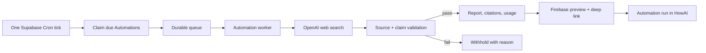

# M4.1 UI refinement and M4.5 Automations

Status: Approved product direction; M4.1 foundation in progress  
Date: 2026-07-15  
Depends on: M3 reminder actions and M4 push delivery  
Rollout: internal accounts, then all eligible users

## Product decision

M4 notification delivery is complete for the internal flow. The next work is
split deliberately:

- **M4.1 — Clean UI refinement** makes the whole app feel content-first,
  lightweight, and consistent before another workspace is exposed.
- **M4.5 — Automations beta** turns reminders into the first member of a broader
  user-facing Automations system and adds scheduled, verified briefings.

`Cron job` and `scheduled job` are backend terms. The app says
**Automations**, with understandable types such as Reminder, News briefing, and
Market briefing.

## M4.1 — Clean UI refinement

Foundation slice completed on 2026-07-15:

- centralized semantic light/dark color tokens and component themes;
- platform-native typography with the existing in-app text-size preference;
- neutral chat header, account-level Free/Pro status, and quieter composer;
- a grouped, readable `+` action sheet using the same semantic surfaces in
  light and dark mode, with Pro labels shown only when relevant;
- wider avatar-free message layout;
- permanently visible compact Copy, Listen, Report, and More controls; and
- one shared new-conversation control in the chat header and conversation
  drawer;
- compact Automations and Knowledge Hub navigation in one drawer group;
- flatter Settings, Profile, Text Size, Voice, Usage, Subscription, and
  Knowledge Hub surfaces with restrained status color and no decorative
  shadows; and
- widget coverage for theme tokens, composer behavior, message-action
  visibility, and drawer consistency.

The route-by-route audit and remaining overlay work are tracked in
`M4_1_UI_AUDIT.md`.

### Experience principles

1. Content gets the most space; navigation and controls stay quiet.
2. One obvious action per state; secondary actions use progressive disclosure.
3. Use neutral surfaces, subtle separators, restrained accent color, and fewer
   stacked cards.
4. Preserve platform conventions for keyboard, sheets, gestures, text size,
   safe areas, and accessibility.
5. Similar actions look and behave the same in Chat, Automations, Research, and
   Voice.
6. The app locale is only a response fallback. HowAI follows intentional
   multilingual and code-switched conversation naturally rather than forcing
   every answer into one interface language.

### Navigation

- Chat remains the home screen.
- Do not restore the persistent Chat/Research/Actions tab bar.
- The top bar contains only the conversation menu and new-chat action.
- The navigation sheet contains conversations, Automations, Research, account,
  and settings.
- Notifications and inline results deep-link to the exact Automation run or
  Research report.
- Rename the user-facing **Actions** workspace to **Automations**. Existing
  backend action and reminder names remain unchanged for compatibility.

### Chat surface

- Assistant messages read like clean document content without a heavy bubble.
- User messages use a quiet, compact bubble.
- Keep Copy, Listen, Report, and More visible in a compact neutral row below
  every completed assistant message. Reporting remains directly discoverable;
  less common actions stay inside More.
- Citations are visible, clickable, and grouped without repeating long raw
  URLs.
- Approval cards size to content and use action-specific buttons such as
  Create, Update, Pause, Resume, Delete, or Snooze.
- Successful actions return as conversational assistant messages, not bottom
  snackbars.

### Composer

- Compact and slightly inset at rest; expands to available width on focus.
- `+`, text, dictation, and live voice are visible only when useful.
- Once text exists, dictation and live voice yield to one clear Send action.
- `Ask HowAI` stays one line at normal text sizes.
- Thinking level or tool state appears only while non-default/active.
- Attachments, image tools, translation, thinking, and future Automation
  templates live in one `+` sheet.

### Engineering and exit gate

- Extract the chat shell, composer controller, message actions, navigation
  sheet, approvals, and workspace routing from the large screen widgets without
  changing state management during this release.
- Add golden/widget tests for empty, conversation, keyboard-open, large-text,
  dark-mode, approval, citation, and notification-deep-link states.
- Verify OAuth return, keyboard focus, push registration, chat streaming,
  reminder approval, and cold-start deep links on a simulator and physical iOS
  device; repeat the platform-relevant subset on Android.
- Exit when product review approves the visual system, supported text scales do
  not clip, touch targets remain accessible, and existing chat/action tests pass.

## M4.5 — Automations beta

### First release capability

Users can ask naturally:

- “Every weekday at 7 AM, send me the five most important AI stories.”
- “Every Friday evening, summarize news about the topics I follow.”
- “At 3:30 PM on market days, explain what moved the U.S. market.”
- “Pause my morning briefing.”
- “Run my AI news briefing now.”

Initial types:

1. **Reminder** — existing one-time and recurring reminder behavior.
2. **News briefing** — topic, item count, schedule, region/language, and source
   preferences.
3. **Market briefing** — session (open/close/daily), watchlist or market scope,
   schedule, and explanatory focus.

Later templates can add itinerary monitoring, calendar preparation, email
summaries, and other connector-backed workflows. M4.5 does not allow arbitrary
scheduled prompts or arbitrary code/tool execution.

### User flow and approval

1. The model proposes a strict, allowlisted Automation template.
2. A compact card shows title, topics/scope, schedule, timezone, delivery,
   source policy, and paid-plan requirement.
3. The user approves once. That approval authorizes future runs only within the
   displayed template.
4. HowAI creates the Automation and confirms it in the conversation.
5. Schedule, topic, source-policy, recipient, or delivery changes create a new
   version and require approval. Pause/resume/delete continue to use the shared
   action-approval contract.
6. Each run is retained in Automations history. A notification contains a short
   privacy-safe preview and opens the full report.

### Trust and validation contract

Web search retrieves information; it is not treated as proof by itself. Every
generated briefing must pass all of these gates before delivery.

#### 1. Deterministic source gate

- Require HTTPS and a successfully fetched/canonical source URL.
- Record publisher, title, publication/update time when available, retrieval
  time, and the complete source list returned by search.
- Apply template-specific freshness windows. A daily news briefing cannot use
  an old story as new merely because a recent page links to it.
- Prefer primary sources, filings, regulators, official statistics, company
  releases, and established publishers. Block known content farms and unsafe
  domains. User-selected domains can narrow this list but cannot bypass safety.
- Detect duplicate/syndicated stories so several copies of one article do not
  count as independent confirmation.

#### 2. Claim-level AI verification

- Generate a structured draft containing claims and their supporting source
  IDs, not final prose only.
- Run a separate verification model pass over the draft and source metadata.
- Check that each factual claim is supported, current for the scheduled run,
  consistent with dates/numbers in the source, and not stronger than what the
  source states.
- For breaking, consequential, or disputed claims, require a primary source or
  two genuinely independent credible sources.
- If sources conflict, explain the disagreement or omit the claim. Never choose
  the more dramatic version silently.
- Remove failed claims and regenerate the concise narrative from the verified
  claim set. If too little remains, mark the run `withheld` and tell the user
  that HowAI could not verify a reliable briefing.

AI review reduces error risk but is not a guarantee of truth. Deterministic
checks, source diversity, durable citations, and fail-closed delivery remain
mandatory.

#### 3. Market-data gate

- Prices, percent changes, volume, top gainers/losers, rankings, and exchange
  calendars must come from a structured market-data provider with timestamps.
- Web search supplies context and explanations, not authoritative quote data.
- Label delayed data and market/session timezone clearly.
- Avoid personalized buy/sell instructions. Market briefings are informational
  summaries with visible source and timing disclosures.

#### 4. Presentation gate

- Every delivered factual item has a visible, clickable citation.
- Show `Updated`/`Verified` time and a concise source list in the report.
- A push notification is only a preview; it never carries an uncited full
  analysis.
- Do not copy full articles. Store the generated report and minimum source
  metadata needed for attribution, audit, and re-opening.

OpenAI's current Responses web-search interface can return inline URL
annotations, the complete consulted-source list, domain filters, live-access
control, and location context. HowAI will retain those artifacts and add its
own validation gate; API citations alone are not considered verification.

### Architecture

- Use one scheduler to claim due Automations; never one cron job per user.
- Enforce unique `(automation_id, scheduled_for)` occurrences and lease/retry
  semantics so duplicate ticks cannot duplicate a report or push.
- Use Supabase Queues or equivalent durable queue behavior between claiming and
  generation.
- The worker calls OpenAI directly through shared server policy, model-routing,
  and usage-ledger code. Do not make a scheduled Edge Function call the existing
  proxy Edge Function over HTTP; Supabase now rate-limits nested/recursive Edge
  Function calls.
- Normal briefings run synchronously within a bounded worker lease. Background
  Responses are reserved for longer user-requested reports and are polled as a
  durable run rather than holding an app connection open.
- Feature flags independently disable generated Automations, web retrieval,
  market data, validation, and notification delivery. Validation failure must
  fail closed even if other flags remain enabled.

### Additive data model

Do not rename or repurpose `reminders`; installed clients and existing server
functions depend on it.

`automations`

- owner, kind, title, status, version
- strict kind-specific config
- timezone, structured recurrence, next run
- delivery and privacy preferences
- entitlement state, last run, created/updated timestamps

`automation_runs`

- automation and unique scheduled occurrence
- queued/running/verifying/succeeded/withheld/failed status
- model/response IDs, usage and estimated cost
- report, preview, structured claims, source metadata
- verification policy version/result and bounded failure details
- attempts, lease, started/completed timestamps

All public user-owned tables use explicit grants plus owner-scoped RLS. Queue
and claim functions remain service-owned, revoke `PUBLIC` execution, validate
the authenticated user where applicable, and are covered by two-user isolation
tests.

### Entitlement and cost policy

- Existing reminders remain available to all signed-in users under abuse
  limits.
- Automatic generated briefings begin as Pro-only, but Free users can see the
  template and value explanation without losing their draft.
- Internal testers first; then full eligible rollout. No percentage ladder is
  needed for this hobby project.
- Initial cap: two active generated Automations per user, one automatic run per
  Automation per day, bounded item count, bounded sources, and bounded output.
- Default generation uses Luna with low reasoning and a concise output target.
  The verification pass uses the least costly model that passes a versioned
  factuality eval; Sol is reserved for manual `Deepen this briefing` or an
  eval-proven need.
- Record both generation and validation usage in the existing AI usage ledger.
- If Pro expires, pause generated Automations and keep their history; reminders
  continue normally.

### Tests and exit gates

- Recurrence, timezone, DST, market-session, holiday, idempotency, lease, retry,
  and duplicate-push tests.
- Two-user RLS isolation and anonymous/service access tests.
- Fixtures for stale articles, dead links, syndicated duplicates, conflicting
  sources, unsupported numbers, changed headlines, future-dated pages, and
  prompt injection inside source content.
- The verifier must withhold unsupported material and cannot be overridden by
  retrieved page instructions.
- Every displayed claim maps to at least one retained source; claims requiring
  corroboration map to the required independent sources.
- Citation links open correctly, timestamps/timezones are visible, and push
  deep links open the correct run from foreground/background/cold start.
- Per-run cost and latency stay within the configured Pro budget in the internal
  fixture and live-source evaluation.
- Rollout is internal accounts first, followed by full eligible rollout only
  after the trust, cost, delivery, and UI gates pass.

## References

- [OpenAI web search, citations, sources, filters, and live access](https://developers.openai.com/api/docs/guides/tools-web-search)
- [OpenAI background mode](https://developers.openai.com/api/docs/guides/background)
- [Supabase Scheduling Edge Functions](https://supabase.com/docs/guides/functions/schedule-functions)
- [Supabase Cron](https://supabase.com/docs/guides/cron)
- [Supabase Queues](https://supabase.com/docs/guides/queues)
- [Supabase nested Edge Function rate limits](https://supabase.com/changelog/43644-edge-functions-rate-limits-on-recursive-nested-edge-functions-calls)
